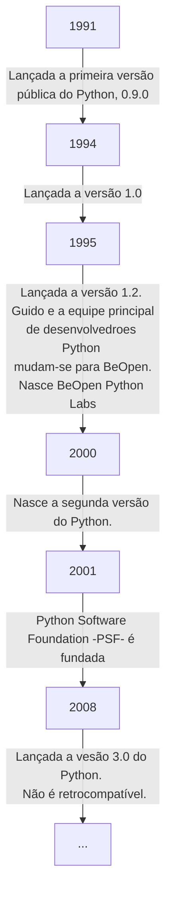

# 
Olá, pessoa bonita! Tudo bem com você? 

Este é um resumo construído com base no curso "Introdução à Ciência de Dados e Python", na plataforma [DIO](https://web.dio.me/home).

Mentor: [@guicarvalho](https://github.com/guicarvalho)

## Sumário

[Página Inicial](./README.md)

[1. Ambiente de desenvolvimeto e Primeiros Passos com Python](./1-primeiros_passos.md#1-ambiente-de-desenvolvimeto-e-primeiros-passos-com-python) <-
* [1.1 Introdução ao Python](#11-introdução-ao-python)
* [1.2 Configuaração do Ambiente de Desenvolvimento](#12-configuração-do-ambiente-de-desenvolvimento)
* [1.3 Primeiro Programa](#13-primeiro-programa)

[2. Conhecendo a Linguagem de Programação Python](./2-introducao.md)

[3. Tipos de Operadores](./3-operadores.md)

[4. Estruturas Condicionais e de Repetição](./4-condicao_e_repeticao.md)

[5. Strings](./5-strings.md)

[6. Listas e Tuplas](./6-listas_e_tuplas.md)

[7. Conjuntos](./7-conjuntos.md)

[8. Dicionários](./8-dicionarios.md)

[9. Funções](./9-funcoes.md)

---

## 

### 1. Ambiente de desenvolvimeto e Primeiros Passos com Python

#### 1.1 Introdução ao Python

Python foi Criado, em 1989, por Guido Van Rossum. A ideia original era dar continuidade a linguagem ABC. Logo, foi muito influenciado pela linguagem ABC, pensada para iniciantes.

* Linguagem fácil e intuitiva;
* Código aberto;
* Código tão inteligível quanto o inglês (síntaxe bonita);
* Adequada para tarefas diárias e produtiva.


Atualmente o estamos na versão 3.10.2 do Python.

##### Onde utilizar o Python?

É um linguagem versátil. 
* Tipagem dinâmica e forte;
* Multiplataforma e multiparadigma;
* Comunidade grande e ativa;
* Curva de aprendizado baixa.

Só não é uma boa para apps mobile.

#### 1.2 Configuração do ambiente de desenvolvimento

Nos sistemas operacionais Linux e MacOS, é provável que o Python já esteja instalado.

> Para verificar a versão instalada do Python, basta abrir o cmd e inserir o comando:

```cmd
python -V
```

No Windows, o Python pode ser baixado por este link: http://www.python.org

Para a instalação, é só seguir os passos neste [tutorial](https://python.org.br/instalacao-windows/.).

#### 1.3 Primeiro Programa

Exibe, na tela, uma mensagem de boas-vindas.

```python
print("Olá Mundo!")
```
---
Feito por [cla-isse](https://github.com/cla-isse) 💜