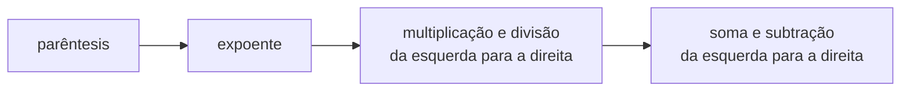

# 
Olá, pessoa bonita! Tudo bem com você? 

Este é um resumo construído com base no curso "Introdução à Ciência de Dados e Python", na plataforma [DIO](https://web.dio.me/home).

Mentor: [@guicarvalho](https://github.com/guicarvalho)

## Sumário

[Página Inicial](./README.md)

[1. Ambiente de desenvolvimeto e Primeiros Passos com Python](./1-primeiros_passos.md)

[2. Conhecendo a Linguagem de Programação Python](./2-introducao.md)

[3. Tipos de Operadores](./3-operadores.md#3-tipos-de-operadores) <-
* [3.1 Operadores Aritméticos](#31-operadores-aritméticos)
* [3.2 Operadores de Comparação](#32-operadores-de-comparação)
* [3.3 Operadores de Atribuição](#33-operadores-de-atribuição)
* [3.4 Operadores Lógicos](#34-operadores-lógicos)
* [3.5 Operadores de Identidade](#35-operadores-de-identidade)
* [3.6 Operadores de Associação](#36-operadores-de-associação)

[4. Estruturas Condicionais e de Repetição](./4-condicao_e_repeticao.md)

[5. Strings](./5-strings.md)

[6. Listas e Tuplas](./6-listas_e_tuplas.md)

[7. Conjuntos](./7-conjuntos.md)

[8. Dicionários](./8-dicionarios.md)

[9. Funções](./9-funcoes.md)

[Bônus: Desafios de Código](./challenges/)

---

## 

### 3. Tipos de Operadores

#### 3.1 Operadores aritméticos

Os operadores aritméticos executam operações matemáticas.

|Operação|Operador|
|---|---|
|Soma|+|
|Subtração|-|
|Multiplicação|*|
|Divisão Real|/|
|Divisão Inteira|//|
|Módulo|%|
|Exponenciação|**|


> A **divisão inteira** não retorna a parte decimal da divisão.
> 
> O **módulo** retorna apenas o resto da divisão.

##### Precedência dos operadores

A execução das operações matemáicas segue a seguinte ordem:



#### 3.2 Operadores de Comparação

Os operadores de comparação servem para comparar dois valores.

|Operação|Operador|
|---|---|
|Igual|==|
|Diferente|!=|
|Maior|>|
|Maior ou Igual|>=|
|Menor|<|
|Menor ou Igual|<=|

> OBS: O operador **=** já está reservado para atribuição, por isso a comparação "igual" é feita com **==**.

#### 3.3 Operadores de Atribuição

Os operadores de atribuição servem para definir o valor inicial ou sobrescrever o valor de uma variável.

##### Atribuição simples

```python
saldo = 500
print(saldo)
>>> 500
```
##### Atribuição com adição ou subtração

```python
saldo = 500
saldo +=200
print(saldo)
>>> 700
```

##### Atribuição com multiplicação

```python
saldo = 500
saldo *= 2
print(saldo)
>>> 1000
```

##### Atribuição com divisão

```python
saldo = 500
saldo /= 5
print(saldo)
>>> 100.0

saldo = 500
saldo //= 5
>>> 100
```

##### Atribuição com muódulo

```python
saldo = 500
saldo %= 4
print(saldo)
>>> 20
```

##### Atribuição com exponenciação

```python
saldo = 8
saldo **= 2
print(saldo)
>>> 64
```

#### 3.4 Operadores Lógicos

Operadores lógicos são utilizados em conjunto com os operadores de comparação, para montar uma expressão lógica. 

Quando um operador de comparação é utilizado, o resultado retornado é um booleano, dessa forma podemos combinar operadores de comparação com os operadores lógicos.

```python
saldo = 1000
saque = 200
limite = 100

saldo >= saque
>>> True

saque <= limite
>>> False
```

##### Operador E

```python
saldo >= saque and saque <=limite
>>> False
```

A expressão é verdadeira apenas se todas as afirmações forem verdadeiras.

##### Operador OR

```python
saldo >= saque or saque <=limite
>>> False
```
A expressão é verdadeira apenas se pelo menos uma afirmação for verdadeiras.

##### Operador NOT

```python
contatos_emergencia = []

not 1000 > 1500
>>> True
# 1000 não é maior que 1500?

not contatos_emergencia
>>> True
# O valor booleano de uma lista vazia é falso. 
# not false = True

not ""
>>> True
# O valor booleano de uma string vazia é falso.
# not false = True

not "saque 1500;"
>>> False
# O valor booleano de uma string é verdadeiro.
# not verdadeiro = False
```

> Sequências vazias, em Python, tem o valor booleano **False**.

##### Parênteses

Por convenção, assim como nas operações matemáticas, nas operações lógicas os parêntes servem para determinar a precedência, ou seja, a sequência em que a expressão é analisada no código.

O exemplo abaixo representa um sistema bancário de saque que segue as regras: 
* Não se pode sacar um valor maior que o disponível na conta.
* Não se pode sacar um valor maior que o limite diário de saque.
* Se a conta for especial, não há limite diário de saque.

```python
saldo = 1000
saque = 250
limite = 200
conta_especial = True

print((saldo >= saque and saque <= limite) or (conta_especial and saldo >= saque))
>>> True

# ou

saque_conta_normal = saldo >= saque and saque <= limite
saque_conta_especial = conta_especial and saldo >= saque

print(saque_conta_normal or saque_conta_especial)
```

#### 3.5 Operadores de Identidade

Operadores de identidade ão utilizados para comparar se os dois objetos testados ocupam a mesma posição na memória.

```python
curso = "Curso de Python"
nome_curso = curso
saldo, limite = 200, 200

curso is nome_curso
>>> True

curso is not nome_curso
>>> False

saldo is limite
>>> True
```

#### 3.6 Operadores de Associação

Operadores de associação utilizados para verificar se um objeto está presente em uma sequência.

> São case sensitive.


```python
curso = "Curso de Python"
frutas = ["laranja","uva","limão"]
saques = [1500,100]

"Python" in curso
>>> True

"maçã" not in frutas
>>> True

200 in saques
>>> False
```
---
Feito por [cla-isse](https://github.com/cla-isse) 💜