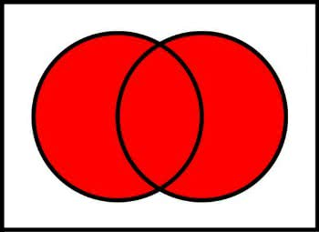
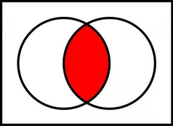
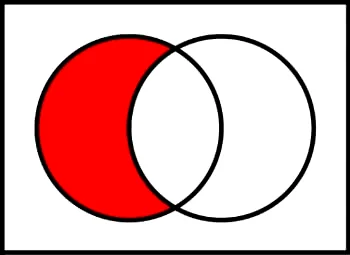
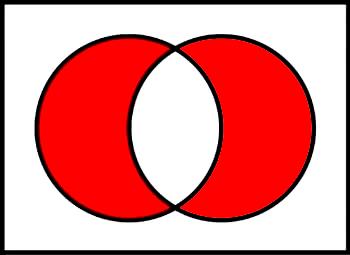

# 
Olá, pessoa bonita! Tudo bem com você? 

Este é um resumo construído com base no curso "Introdução à Ciência de Dados e Python", na plataforma [DIO](https://web.dio.me/home).

Mentor: [@guicarvalho](https://github.com/guicarvalho)

## Sumário

[Página Inicial](./README.md)

[1. Ambiente de desenvolvimeto e Primeiros Passos com Python](./1-primeiros_passos.md)

[2. Conhecendo a Linguagem de Programação Python](./2-introducao.md)

[3. Tipos de Operadores](./3-operadores.md)

[4. Estruturas Condicionais e de Repetição](./4-condicao_e_repeticao.md)

[5. Strings](./5-strings.md)

[6. Listas e Tuplas](./6-listas_e_tuplas.md)

[7. Conjuntos](./7-conjuntos.md#7-conjuntos) <-
* [7.1 Criação de Conjuntos e Acesso aos Dados](#71-criação-e-acesso-aos-dados)
* [7.2 Métodos da Classe set](#72-métodos-da-classe-set)

[8. Dicionários](./8-dicionarios.md)

[9. Funções](./9-funcoes.md)

[Bônus: Desafios de Código](./challenges/)

---

## 

### 7. Conjuntos

#### 7.1 Criação e Acesso aos Dados

Um **set** é uma coleção que não possui objetos repetidos.

Usamos sets para representar conjuntos matemáticos ou eliminar itens duplicados de um iterável.

```python
set([1 , 2 , 3 , 1 , 3 , 4 ]) 
# {1, 2, 3, 4)

set(" abacaxi") 
# {"b", "a", "c", "x", "i"}

set((" palio", " gol", " celta", " palio")) 
# {"gol", "celta", "palio"}
```

Conjuntos em Python não suportam indexação e nem
fatiamento, caso seja necessário acessar os seus valores, é preciso converter o conjunto para lista.

```python
numeros = {1, 2, 3, 4}

numeros = list(numeros)

numeros[0]
# 1
```

##### Iterar Conjuntos

A forma mais comum para percorrer os dados de um conjunto é utilizando o comando for.

```python
carros = {"gol", "celta", "palio"}

for carro in carros:
  print(carro)
```

##### Função Enumerate

Às vezes é necessário saber qual o índice do objeto dentro do laço for Para isso podemos usar a função enumerate.

```python
carros = {"gol", "celta", "palio"}

for indice, carro in enumerate(carros):
  print(f"{indice}: {carro}")
```

#### 7.2 Métodos da classe set

##### union()



```python
conjunto_a = {1 , 2}
conjunto_b = {3 , 4}

conjunto_a.union(conjunto_b) 
# {1, 2, 3, 4}
```

##### intersection()



```python
conjunto_a = {1 , 2 , 3}
conjunto_b = {2 , 3 , 4}

conjunto_a.intersection(conjunto_b) 
# {2, 3}
```

##### difference()



```python
conjunto_a = {1 , 2 , 3}
conjunto_b = {2 , 3 , 4}

conjunto_a.difference(conjunto_b) 
# {1}
conjunto_b.difference(conjunto_a) 
# {4}
```

##### symmetric_difference()



```python
conjunto_a = {1 , 2 , 3}
conjunto_b = {2 , 3 , 4}

conjunto_a.symmetric_difference(conjunto_b) 
# {1, 4}
```

##### issubset()

Verifica se um conjunto é subconjunto de outro e retorna valores booleanos.

```python
conjunto_a = {1, 2, 3}
conjunto_b = {4, 1, 2, 5, 6, 3}

conjunto_a.issubset(conjunto_b) 
# True
conjunto_b.issubset(conjunto_a) 
# False
```

##### issuperset()

Verifica se um conjunto contém outro e retorna valores booleanos.

```python
conjunto_a = {1, 2, 3}
conjunto_b = {4, 1, 2, 5, 6, 3}

conjunto_a.issuperset(conjunto_b) 
# False
conjunto_b.issuperset(conjunto_a) 
# True
```

##### isdisjoint()

Verifica se dois conjuntos não tem nenhuma relação e retorna valores booleanos.

```python
conjunto_a = {1, 2, 3, 4, 5}
conjunto_b = {6, 7, 8, 9}
conjunto_c = {1 , 0}

conjunto_a.isdisjoint(conjunto_b) 
# True
conjunto_a.isdisjoint(conjunto_c) 
# False
```

##### add()

```python
sorteio = {1 , 23}

sorteio.add(25) 
# {1, 23, 25}
sorteio.add(42) 
# {1, 23, 25, 42}
sorteio.add(25) 
# {1, 23, 25, 42} 
# Nada acontece porque o número 25 já estava no conjunto
```

##### clear()

```python
sorteio = {1 , 23}

sorteio.clear()

sorteio 
# {}
```

##### copy()

```python
sorteio = {1 , 23}

sorteio 
# {1, 23}

sorteado = sorteio.copy()
sorteio 
# {1, 23}
sorteado 
# {1, 23}
```

##### discard()

```python
numeros = {1, 2, 3, 1, 2, 4, 5, 5, 6, 7, 8, 9, 0}

numeros 
# {1, 2, 3, 4, 5, 6, 7, 8, 9, 0}

numeros.discard(1)

numeros.discard(45)

numeros 
# {2, 3, 4, 5, 6, 7, 8, 9, 0}
```

##### pop()

```python
numeros = {1, 2, 3, 1, 2, 4, 5, 5, 6, 7, 8, 9, 0}

numeros 
# {0, 1, 2, 3, 4, 5, 6, 7, 8,

numeros.pop() 
# 0
numeros.pop() 
# 1

numeros 
# {2, 3, 4, 5, 6, 7, 8, 9}
```

##### rmemove()

```python
numeros = {1 , 2 , 3 , 1 , 2 , 4 , 5 , 5 , 6 , 7 , 8 , 9 , 0}

numeros 
# {0, 1, 2, 3, 4, 5, 6, 7, 8, 9}

numeros.remove(0) 
# 0

numeros 
# {1, 2, 3, 4, 5, 6, 7, 8, 9}
```

> A diferença entre discard() e remove() é que o primeiro não retorna erro se for pedido para que seja descartado um número que não está no conjunto.

##### len()

```python
numeros = {1, 2, 3, 1, 2, 4, 5, 5, 6, 7, 8, 9, 0}

len(numeros) 
# 10
```

##### in()

```python
numeros = {1, 2, 3, 1, 2, 4, 5, 5, 6, 7, 8, 9, 0}

1 in numeros 
# True

10 in numeros 
# False
```
---
Feito por [cla-isse](https://github.com/cla-isse) 💜