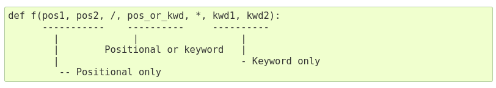

# 
Olá, pessoa bonita! Tudo bem com você? 

Este é um resumo construído com base no curso "Introdução à Ciência de Dados e Python", na plataforma [DIO](https://web.dio.me/home).

Mentor: [@guicarvalho](https://github.com/guicarvalho)

## Sumário

[Página Inicial](./README.md)

[1. Ambiente de desenvolvimeto e Primeiros Passos com Python](./1-primeiros_passos.md)

[2. Conhecendo a Linguagem de Programação Python](./2-introducao.md)

[3. Tipos de Operadores](./3-operadores.md)

[4. Estruturas Condicionais e de Repetição](./4-condicao_e_repeticao.md)

[5. Strings](./5-strings.md)

[6. Listas e Tuplas](./6-listas_e_tuplas.md)

[7. Conjuntos](./7-conjuntos.md)

[8. Dicionários](./8-dicionarios.md)

[9. Funções](./9-funcoes.md#9-funções) <-

[Bônus: Desafios de Código](./challenges/)

---

## 

### 9. Funções

Função é um bloco de código **identificado** por um nome e pode
receber uma lista de **parâmetros**. Esses parâmetros podem ou
não ter valores padrões.

Usar funções torna o código mais
legível e possibilita o reaproveitamento de código.

Programar baseado em funções, é o mesmo que dizer que estamos
programando de maneira estruturada.

```python
def exibir_mensagem():
  print("Olá Mundo!")

exibir_mensagem()
>>> Olá Mundo!
```

Se uma função tem um argumento (nome, no exemplo abaixo) é preciso declarar seu valor, na própria função (que se tornará o retorno padrão) ou na execução do programa.

Se valores diferentes forem declarados na função e na execução, o valor da execução sobrescreverá o do retorno padrão.

```python
def exibir_mensagem_2(nome):
  print(f"Seja bem-vindo, {nome="None"}!")

exibir_mensagem_2(nome="Guilherme")
>>> Seja bem-vindo, Guilherme!

# ou 

exibir_mensagem_2()
>>> Seja bem-vindo, None!
```

##### Argumentos Nomeados

Funções podem ser chamadas usando argumentos
nomeados da forma chave=valor.

```python
def salvar_carro(marca, modelo, ano, placa):
  # salva carro no banco de dados
  print(f"Carro inserido com sucesso! {marca}/{modelo}/{ano}/{placa}")

salvar_carro("Fiat", "Palio", 1999, "ABC-1234")

# 2

salvar_carro(marca="Fiat", modelo="Palio", ano=1999, placa="ABC-1234")

# 3

salvar_carro(**{"marca": "Fiat", "modelo":"Palio", "ano": 1999, "placa":"ABC-1234"})

# Carro inserido com sucesso! Fiat/Palio/1999/ABC-1234
```

> Ao chamar a função, é mais vantajoso passar os valores com suas respectivas chaves (método 2), para evitar confusão no input dos valores .

##### Return()

Para retornar um valor, utilizamos a palavra reservada **return**. Toda função Python retorna *None* por padrão. 
Diferente de outras linguagens de programação, em Python uma função pode retornar mais de um valor.

```python
def retorna_antecessor_sucessor(numero):
  antecessor = numero - 1
  sucessor = numero + 1
  
  return antecessor, sucessor

print(retorna_antecessor_sucessor(10))
>>> {9, 11}
```

##### Args e Kwargs

Podemos combinar parâmetros obrigatórios com args e
kwargs Quando esses são definidos (*args e **kwargs), o
método recebe os valores como tupla e dicionário,
respectivamente.

```python
def exibir_poema(data_extenso, *args, **kwargs):
  texto = "\n".join(args)
  meta_dados = "\n".join([f"{chave.title()}:{valor}" for chave, valor in kwargs.items()])
  mensagem = f"{data_extenso}\n\n{texto}\n\n{meta_dados}"
  print(mensagem)

exibir_poema("Sáb, 23 Set 2023",
"Zen of Python", 
"Beautiful is better than ugly.",
"Beautiful is better than ugly.",
"Explicit is better than implicit.",
"...",
autor="Tim Peters", 
ano=1999)
```

> A primeira string declarada: "Sáb, 23 Set 2023", será considerada data_extenso.
>
> Os valores separador por vírula (declarados como tupla) serão considerados *args.
>
> Os valores declarados em estrutura chave-valor serão considerados **kwargs.

##### Parâmetros Especiais

Por padrão, argumentos podem ser passados para uma função
Python tanto por posição quanto explicitamente pelo nome.

Para uma melhor legibilidade e desempenho, faz sentido restringir a maneira pela qual argumentos possam ser passados, assim um desenvolvedor precisa apenas olhar para a definição da função para determinar se os itens são passados por posição, por posição e nome, ou apenas nome.



###### Positional Only (/)

```python
def criar_carro (modelo, ano, placa, /, marca, motor, combustivel):
  print(modelo, ano, placa, marca, motor, combustivel)

criar_carro("Palio", 1999, "ABC-1234", marca="Fiat", motor="1.0",combustivel="Gasolina") 
# válido

criar_carro(modelo="Palio", ano=1999, placa="ABC-1234", marca="Fiat",motor=" 1.0", combustivel="Gasolina") 
# inválido
```

###### Keyword Only (*)

```python
def criar_carro (*, modelo, ano, placa, marca, motor, combustivel):
  print(modelo, ano, placa, marca, motor, combustivel)

criar_carro(modelo="Palio", ano =1999, placa="ABC-1234", marca="Fiat",
motor="1.0", combustivel="Gasolina") 
# válido

criar_carro("Palio", 1999, "ABC-1234", marca="Fiat", motor="1.0",
combustivel="Gasolina") 
# inválido
```

###### Keyword and Positional Only

```python
def criar_carro (modelo, ano, placa, /, *, marca, motor, combustivel):
  print(modelo, ano, placa, marca, motor, combustivel)

criar_carro("Palio", 1999, "ABC 1234", marca="Fiat", motor="1.0", combustivel="Gasolina") 
# válido

criar_carro(modelo="Palio", ano=1999, placa="ABC-1234", marca="Fiat", motor="1.0", combustivel="Gasolina")
# inválido
```

###### Objetos de Primeira Classe

Em Python tudo é objeto, dessa forma funções também são
objetos. Isso as torna objetos de primeira classe.

Isso significa que é posível:
* Atribuir funções a variáveis;
* Passá-las como parâmetro para outras funções;
* Usá-las como valores em estruturas de dados (tuplas, dicionários, etc);
* Usá-las como valor de retorno para uma função (closures).

```python
def somar (a, b):
  return a + b

def exibir_resultado (a, b, funcao):
  resultado = funcao(a, b)
  print(f"O resultado da operação {a} + {b} = {resultado}")

exibir_resultado(10, 10, somar) 
# O resultado da operação 10 + 10 = 20
```

###### Escopo Local e Global

Python trabalha com escopo local e global.

Dentro do bloco da função, o **escopo é local**, portanto alterações ali feitas em objetos imutáveis serão perdidas quando o método terminar de ser executado.

Para usar objetos globais, utilizamos a palavra chave **global**, que informa ao interpretador que a variável que está sendo manipulada no escopo local é global.
> Essa NÃO é uma boa prática e deve ser evitada

```python
salario = 2000 # escopo global

def salario_bonus(bonus):
  global salario
  salario += bonus
  return salario

salario_bonus(500)
>>> 2500
```

> OBS: Já que listas são objetos imutáveis, as alterações de escopo local não são apagadas ao final da execução do programa. 
>
>Assim, é recomendável criar uma cópia da lista para fazer as alterações.
---
Feito por [cla-isse](https://github.com/cla-isse) 💜